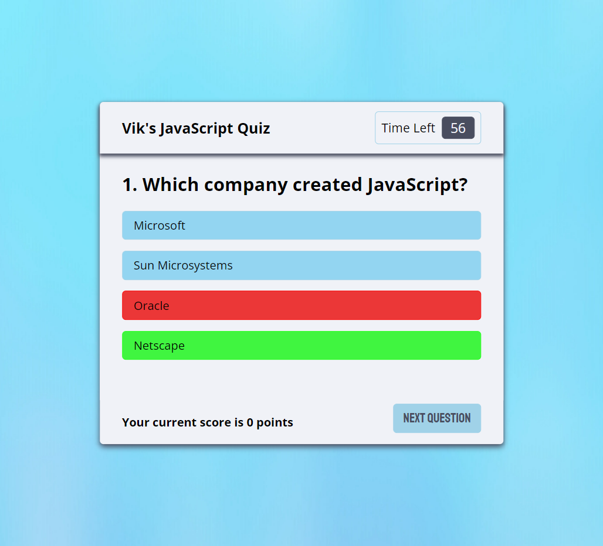

# Vik's JavaScript Code Quiz

## Description

JavaScript is important, very important, and as new students to the language attempt to learn it, it is helpful to utilize any resource at their disposal. With that in mind, the purpose of this project is to create a quiz app on JavaScript history and fundamentals. The timed web-based quiz can be taken by anyone online and the program includes the following features:

- The quiz is entirely online and can be taken repeatedly
- It is multiple choice and has several choices that displays the right or wrong answer depending on the user choice
- Once the quiz begins a timer starts to count down from 75 seconds, and once the counter reaches 0, the quiz is over
- Once a question is answered, the user is prompted to move to the next answer
- The user earns 100 points for each answer and the point total is shown at the bottom of the window
- Once the quiz is over the points are totaled and displayed to the user
- The user can save their score along with their initials, while a list of high scores are displayed for comparison or inclusion (functionality coming soon)

This quiz, although a simple and straightforward resource, will hopefully provide some new information for anyone attempting to increase their JavaScript knowledge.

Link to the deployed website: https://vik-maharaj.github.io/code-quiz/

## Installation

The repo contains an index.html file, and assets folder containing a CSS file sytlesheet, an image folder, and a javascript folder. These files were deployed at the above-mentioned link using GitHub Pages. The repo can also be cloned to a local machine and the index.html file can be opened in any web browser or IDE of choice.

## Usage

Using any desktop browser, open the above-mentioned link to view the webpage... and to take the quiz!

## Credits

Collaborators include the instructor, TAs, and fellow classmates of the UCF Coding Bootcamp (Spring 2022).

## License

Copyright (c) 2022 Vik Maharaj

Permission is hereby granted, free of charge, to any person obtaining a copy of this software and associated documentation files (the "Software"), to deal
in the Software without restriction, including without limitation the rights to use, copy, modify, merge, publish, distribute, sublicense, and/or sell copies of the Software, and to permit persons to whom the Software is furnished to do so, subject to the following conditions:

The above copyright notice and this permission notice shall be included in all copies or substantial portions of the Software.

THE SOFTWARE IS PROVIDED "AS IS", WITHOUT WARRANTY OF ANY KIND, EXPRESS OR IMPLIED, INCLUDING BUT NOT LIMITED TO THE WARRANTIES OF MERCHANTABILITY,
FITNESS FOR A PARTICULAR PURPOSE AND NONINFRINGEMENT. IN NO EVENT SHALL THE AUTHORS OR COPYRIGHT HOLDERS BE LIABLE FOR ANY CLAIM, DAMAGES OR OTHER LIABILITY, WHETHER IN AN ACTION OF CONTRACT, TORT OR OTHERWISE, ARISING FROM, OUT OF OR IN CONNECTION WITH THE SOFTWARE OR THE USE OR OTHER DEALINGS IN THE SOFTWARE.

## Badges

